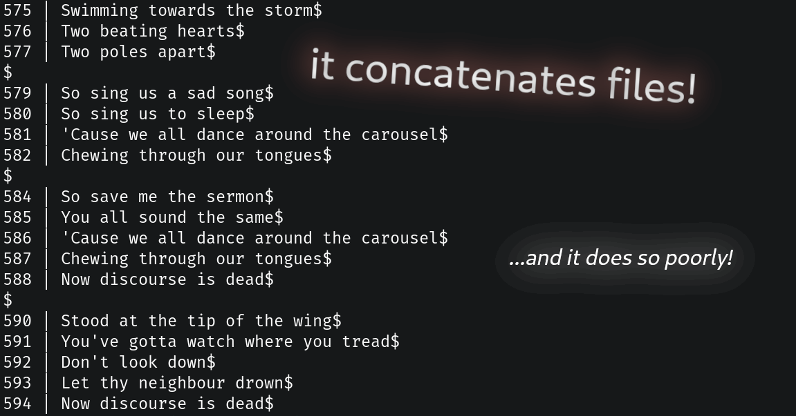

# cat-java
Yet another clone of GNU cat, but with literally nothing going for it.


## Usage
Use another implementation of cat.

Alternatively, if you hate yourself:

- Have at least Java 11 installed
- Grab a precompiled executable from the Releases page (one with the suffix
  jar-with-dependencies.jar)
- Use it in the terminal with 'java -jar cat-x.x.x-jar-with-dependencies.jar',
    - I'd recommend renaming the file to something less painful to type... or
      just use regular GNU coreutils cat

```java -jar cat-x.x.x-jar-with-dependencies.jar [options] [file(s)...]```

Options:
- ```-b```, ```--number-nonblank``` - number nonempty lines.
- ```-E```, ```--show-ends``` - display $ at the end of each line.
- ```-h```, ```--help``` - display help message and exit.
- ```-n```, ```--number``` - number all lines.
- ```-s```, ```--squeeze-blank``` - suppress repeated empty lines.
- ```-v```, ```--version``` - display version information and exit.

Note that these **do not behave exactly** like the regular cat options.
These are merely cheap replicas that may do things slightly differently.

## Dependencies
If you are not a developer, you should not need to worry about this section. All
required runtime dependencies come bundled in the jar archive.

Dependencies are managed using Maven.

- **Java** 11.0.10
- [**Apache Commons CLI**](https://commons.apache.org/proper/commons-cli/) 1.4
- And that's it really